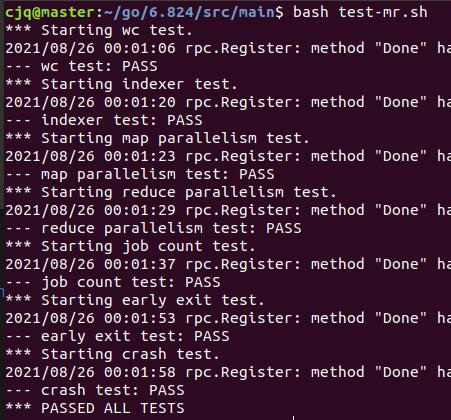
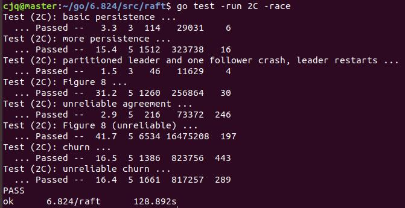

# DistributedLab
## 说明

MIT 6.824分布式系统课程Lab

目前只完成了Lab1 MapReduce，Lab2 Raft（除了2021版实验的Lab2D）

出于对MIT6.824课程Collaboration Policy的尊重，这里仅写一些在做lab时候的思路踩过的坑以及注意到的点，不公开任何代码

## 开发环境

操作系统：虚拟机VMware® Workstation 15 Pro 下运行的Ubuntu18.04 x64

Golang版本：1.16.7

编辑器：VSCode

## Lab 1: MapReduce

通过所有项目的测试

总的来说lab1的难度并不大，在读过paper且看过课程视频之后还是比较容易实现的，且网站的实验说明还提供了非常多的提示。

### worker实现

使用了eventLoop的模型，也就是首先通过rpc向coordinator请求任务，然后根据请求到的任务做不同的操作，有map任务、reduce任务以及停机任务。

**map任务**：

- 读取文件内容，将文件名和内容作为参数调用map函数
- 将map函数处理的结果分散放入中间json文件中
- 通过rpc通知协调者map操作已完成

**reduce任务**：

- 根据自己分配到的任务号打开中间json文件
- 对读取出的数据进行排序，然后调用reduce函数
- 将结果写入文件
- 通过rpc通知协调者reduce操作已完成

**停机任务**：

- 直接终止程序

### coordinator实现

使用buffered channel这一同步原语作为事件队列。

这里使用了三个channel，分别用于向worker分配任务，接收worker任务完成的消息，接收定时器超时的事件。再结合select基本上就是事件驱动的模型

首先coordinator直接向分配任务的channel里面放入所有的map任务，随后各个worker调用rpc并发的从这一channel里争抢任务并处理。

在worker完成自己的map任务之后，调用rpc向接收worker任务完成的消息channel里插入自己任务完成的消息，随后coordinator select到这一消息后记录这一任务已完成。

在coordinator向channel里分发任务之时会同时为这一任务开启一个定时器任务，在超时后定时器协程会向超时channel发一条消息，从而让coordinator获知，coordinator会将这一超时任务重新放入任务分配channel供worker们争抢处理。同时为了防止新任务刚布置下去，上一轮处理这一任务的完成消息由于网络等问题姗姗来迟，从而导致任务被执行两次的问题，这里多使用了一个变量来记录当前任务是第几次执行，coordinator只认最后那次执行的任务完成消息，一律不认前几次的。

在所有map任务都完成之后coordinator就开始分配reduce任务，流程与以上基本一致。

最终所有map和reduce任务都完成之后将分配任务的channel关闭，worker会将channel关闭视为停机任务，从而所有结点程序终止

## Lab 2: Raft

通过了2A~2C所有的测试。其中2C我循环测试了200次，每一次都全PASS，包括最困难的测试case Figure8 （unreliable)。不敢说完全bug free，但已经圆满完成实验要求了。

2021版Lab新增了关于snapshot的的2D，这一部分在原paper中本身就是附加的部分，且实现细节方面的描述较少，再加上这是今年新增的网上关于它的参考资料较少，因此实现会比较困难，再加上个人时间问题便决定完成2C部分就暂停

### 2A部分

这一部分主要要求实现领导人选举，这一部分要注意的主要在于代码框架的设计，如果代码写的太随意就可能会导致后续实验里改这改那比较乱，且可能会存在不明显的bug。

例如：我最初对于选举部分的设计使用的是waitgroup，为其他每一个raft peer开一个协程向他们发送requestVote rpc，在得到这一raft peer的投票结果之后就调用waitgroup.done方法。而主协程则使用waitgroup.wait等待所有投票协程完成，再进一步检查选举是否成功或是否选举超时。使用这一模型编写的代码可以通过前两项测试，但第三项测试就挂了。经过查询输出的log得知候选人在拿到多数票后仍卡在选举协程等待所有投票协程完成，没有及时向其他raft peer发送心跳，从而导致其他raft peer超时又开始一轮新选举，造成选不出leader。在这一实验中提供给我们的rpc模拟了一种不可靠的网络环境，每次调用rpc可能会成功，也可能会失败，且在这之间也可能会存在延迟，因此选举过程中主协程不能等待所有子协程都退出，必须在票数达到半数后马上就开始leader的操作给peer发心跳。因此在这里选举主协程采用条件变量进行等待，在票数过半、超时、发现选举过期、被kill等事件发生时就会退出循环开始下一步处理不等子协程。

另一方面是我最初向所有follower发送心跳的方法是为每一个follower开一个协程，这个协程里运行一个死循环，每次循环调用一次appendEntries rpc，然后sleep 50ms。这里存在的问题是这个不可靠的rpc并不是每回都会立即返回，也不是每回调用都会成功，因此可能会导致一次循环中的appendEntries rpc阻塞非常长的时间，经过我的测试阻塞久的时候会长达800 900乃至1000多毫秒，从而大大减少了心跳。我一直到最后做2C的时候卡在Figure8 （unreliable)这个case上就是由于这一点，最后改成每隔50ms就开一个协程单独发送appendEntries rpc，这才得以通过这一case。

#### 一些点

- 关于选举超时以及心跳时间的选择，这里我的心跳间隔选为50ms，选举超时设定为随机200~400ms，可以通过脚本测试。虽然网站说明页面上要求1s不能多于10次心跳，但这样也能通过，就不管这么多了。
- **不要带锁进rpc**，否则容易造成死锁。
- 心跳并不是一个特殊的rpc，它就是appendEntries，只是有新log需要发送就放进去一起发，也就是同时承载附加条目和心跳两项任务
- 关于调试方法，IDE断点调试基本是不用想了，只能是在程序的关键点打印log，这里可以使用util.go里的DPrintf函数，将DEBUG变量设置为true之后即可输出，比较方便。不想输出log将DEBUG变量设置为false即可

总之看着paper figure2以及网站上给的提示，2A的三个case还是比较容易通过的

#### 测试中存在的问题

测试第二项election after network failure这个case中时不时会失败。

在查看log之后我基本弄清楚了这个case在干嘛，以及为什么会错。

首先这个case创建三个raft peer结点，第一阶段三个结点之间网络通畅，因此可以正常选出一个leader。然后随机其中一个raft peer与另外两个peer失联，也就是制造一个两个网络分区，进入第二阶段。如果被隔离的这个peer是leader，则另外两个follower会自行选举出新的leader；如果被隔离的peer是follower，则这一follower会开启新一轮选举，但会由于拿不到多数票永远无法成功，另外两个follower正常继续。最后将三个raft peer分别隔离，此时测试脚本希望看到的是三个peer都由于拿不到多数票无法成为leader，但问题也就出现在了这里。

如果第一个被隔离的raft peer是leader，那么他会一直保持旧term的leader状态直到最后，从而导致测试脚本在最后发现仍然有leader存在判定失败。

翻阅paper之后确定，一个LEADER只有在向其他follower发起rpc，或是有其他候选人向他请求投票rpc之后，从而发现自己过期，才会转变为FOLLOWER。除此以外leader会一直维持自己的状态。且在paper中对于选举安全性的说法是**对于每一个term，仅会有一个leader被选出**。也就是说**raft保证每个term只有一个leader，而无法保证每时每刻集群中只有1个leader**。

在课程网站的note中找到一个关于这一情行的说明：https://pdos.csail.mit.edu/6.824/notes/l-raft.txt

总体意思就是，由于网络分区等原因处于旧term的leader无法将他的日志复制给多数的follower，从而使他的日志无法提交，并不会影响新term的leader向follower提交日志

结合网上一些其他做这一lab的朋友的说法，基本可以确定测试脚本这一处存在bug。知乎上貌似还有大佬给6.824课程组的老师发了邮件，证实了这里确实存在bug

### 2B部分

这一部分主要实现日志复制，主要就是在appendEntries和领导协程中做一些增改。想要通过2B测试的话还是相对容易一些的。

#### 一些点

- commit index的更新以及向服务层chan发送applymsg这两件事最好全程单独开一个协程在后台处理，不要在每回调用完rpc的时候顺便处理，容易出错。可以使用条件变量，在matchindex发生改变时唤醒这一协程起来处理，或者像课程网站上建议的那样每隔10ms唤醒处理一次，反正就是不要自旋等待浪费CPU时间就行。
- 注意paper中figure 8的问题，leader只能决定提交处于自己term的log，在更新commitindex时要注意这里
- 选举超时定时器是不能随便重置的，这在student-guide中提到了。只有三种情况应当重置，否则在2B和2C中很容易出现一些选举的问题
  1. 收到了处于当前term的leader的appendEntries rpc
  2. 决定开始一轮新的选举
  3. 同意给除了自己以外的某个raft peer投票

### 2C部分

这一部分主要是实现状态持久化，单论这一任务来说是非常简单的，只要把两个关于persist的函数实现了，然后在currentTerm，votedFor，logs发生改变时调用就行了。但是如果仅仅只是加上这一步可能仍然无法通过2C的所有测试case，即使你已经通过了2A 2B的全部case。2C当中的case相比2A和2B，特别是最后几个case，它模拟的网络中断、结点宕机等情况更为极端和严重，从而暴露出此前代码中存在的问题

#### 一些点

- 论文里提到，如果appendEntries因为日志不一致而返回了false，就减少nextindex重试。这里如果采用每回-1的方式会导致效率很低，很容易造成最后几个case超时。这里可以对回退方案进行优化，在appendEntries rpc的reply中加入conflictIndex和conflictTerm两个信息，让leader能够根据这些信息来判断回退多少，从而在每次rpc中携带更多的log，同时减少rpc的次数。这一高效回退算法的详细说明见student-guide
- figure 2中的算法基本上都要严格执行，不能自作主张更改或减少
- 如果发现有case通不过，请参考student-guide以及一些大佬的博客提到的问题，确认自己是否猜了里面提到的坑。
- 一定一定不要去看别人做的源代码，这样做完lab收获和成就感都会大大减少，加油！

## 参考

MIT6.824课程官方网站 https://pdos.csail.mit.edu/6.824/

raft paper中文翻译 https://github.com/maemual/raft-zh_cn

raft动画演示http://thesecretlivesofdata.com/raft/

MIT6.824 2020中文翻译录播课(非机翻) https://www.bilibili.com/video/BV1x7411M7Sf

课程助教编写的关于raft实验的指引student-guide https://thesquareplanet.com/blog/students-guide-to-raft/

